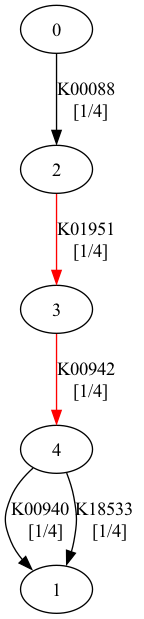

# kegg-pathways-completeness tool

This tool computes the completeness of each [KEGG pathway module](https://www.genome.jp/kegg/module.html) for given set of [KEGG orthologues (KOs)](https://www.genome.jp/kegg/ko.html) based on their presence/absence. The current version of this tool has 482 KEGG modules (updated 02/07/2024). 

Please read the **Theory** section at the bottom of this README for a detailed explanation. 

#### Input example
- [per contig annotation](example/example_hmmscan_annotation.txt) with KOs (ideally given from hmmscan annotation (see [instructions](src/README.md)));  \
or 
- [list](example/example_list_kos.txt) of KOs.

#### Output example

- `*.summary.kegg_pathways.tsv` ([example](example/example_hmmscan.summary.kegg_pathways.tsv)) contains module pathways completeness calculated for all KOs in the given input file.
- `*.summary.kegg_contigs.tsv` ([example](example/example_hmmscan.summary.kegg_contigs.tsv)) contains module pathways completeness calculated per each contig (first column contains name of contig) if contig annotation were provided with `-i`.

Optional:
- `pathways_plots/` ([example](example/pathways_plots)) folder containing PNG representation and graphs generated with `--plot-pathways` argument. 
- `with_weights.*.tsv` [example](example/with_weights.summary.kegg.summary.kegg_contigs.tsv) of output generated with `--include-weights` argument. Each KO has a weight in brackets.

Check more examples of different output files [here](tests/fixtures/give_pathways/output).

## Installation
This tool was published in Pypi and Bioconda:

#### Install with pip
```commandline
pip install kegg-pathways-completeness
```

#### Install with bioconda
Follow [bioconda instructions](https://bioconda.github.io/recipes/kegg-pathways-completeness/README.html#package-package%20&#x27;kegg-pathways-completeness&#x27;)


#### Install from source using venv/conda env (not the best option)
```commandline
conda create --name kegg-env
conda activate kegg-env

pip3 install -r requirements.txt
```


## How to run

#### Quick start
```
# for list of KOs
give_pathways -l {INPUT_LIST}

# per contig annotation with KOs
give_pathways -i {INPUT_FILE}
```

#### Run with test examples
```comandline
# hmmtable as input
python3 kegg_pathways_completeness/bin/give_pathways.py \
  -i 'tests/fixtures/give_pathways/test_pathway.txt' \
  -o test_pathway

# KOs list as input
python3 kegg_pathways_completeness/bin/give_pathways.py \
  -l 'tests/fixtures/give_pathways/test_kos.txt' \
  -o test_list_kos
```

#### Run using docker 
Results can be found in folder `results`. Final annotated pathways are generated in `results/pathways`
```commandline
export INPUT="path to hmm-result table"
docker \
    run \
    -i \
    --workdir=/results \
    --volume=`pwd`/results:/results:rw \
    --volume=${INPUT}:/files/input_table.tsv:ro \
    quay.io/microbiome-informatics/kegg-completeness:v1.1 \
    /tools/run_pathways.sh \
    -i /files/input_table.tsv
```


## Input arguments description

**Required arguments:** 

_input file:_

An input file is required under either of the following commands:
- input table (`-i`/`--input`): hmmsearch table ([example](tests/fixtures/give_pathways/test_pathway.txt)) that was run on KEGG profiles DB with annotated sequences (preferable). If you don't have this table, follow these [instructions](src/README.md) to generate it.
- file with KOs list (`-l`/`--input-list`): comma separated file with list of KOs ([example](tests/fixtures/give_pathways/test_kos.txt)).

**Optional arguments:**

- output prefix (`-o`/`--outname`): prefix for output tables (`-o test_kos` in [example](tests/fixtures/give_pathways/output/test_kos.summary.kegg_contigs.tsv))
- add weight information to output files (`-w`/`--include-weights`). The output table will contain the weight of each KO edge in the pathway graph, for example K00942(0.25) means that the KO has 0.25 importance in the given pathway. Example of [output](tests/fixtures/give_pathways/output/test_weights.summary.kegg_pathways.tsv)
- plot present KOs in pathways (`p`/`--plot-pathways`): generates a PNG containing a schematic representation of the pathway. Presented KOs are marked with red edges. Example: [M00002](tests/fixtures/give_pathways/output/pathways_plots/M00002.png)


_pathways data: modules information and graphs_ 

This repository contains a set of pre-generated files. Modules information files can be found in **[pathways_data](kegg_pathways_completeness/pathways_data)**. 
The repository also contains pre-parsed module pathways into graphs format. In order to generate graphs all pathways were parsed with the NetworkX library. The graph for every module is shown in .png format in [png folder](kegg_pathways_completeness/graphs/png) and .dot format in [dots folder](kegg_pathways_completeness/graphs/dots). Pathway and weights of each KO can be easily checked with the .png image.

**In order to run a tool there is no need to re-generate those files again.**
All [graphs re-generation instructions](kegg_pathways_completeness/graphs/README.md) and [module pathways info re-generation commands](kegg_pathways_completeness/pathways_data/README.md) are provided for updates and understanding a process.

_modules information:_

- list of KEGG modules in KOs notation (`-a`/`--pathways`) (latest [all_pathways.txt](kegg_pathways_completeness%2Fpathways_data%2Fall_pathways.txt))
- list of classes of KEGG modules (`-c`/`--classes`) (latest [all_pathways_class.txt](kegg_pathways_completeness%2Fpathways_data%2Fall_pathways_class.txt))
- list of names of KEGG modules (`-n`/`--names`) (latest [all_pathways_names.txt](kegg_pathways_completeness%2Fpathways_data%2Fall_pathways_names.txt))

_graphs:_

- graphs constructed from each module (`-g`/`--graphs`) (latest [graphs.pkl](kegg_pathways_completeness%2Fgraphs%2Fgraphs.pkl))


### Plot pathway completeness

**NOTE**: please make sure you have [**graphviz**](https://graphviz.org/) installed

You can also run the plotting script separately:
```commandline
plot_completeness_graphs.py -i output_with_pathways_completeness
```

#### Example



More examples for test data [here](tests/fixtures/give_pathways/output/pathways_plots)


## Theory: 
#### Pathways to graphs 
KEGG provides a representation of each pathway as a specific expression of KOs.
example **A ((B,C) D,E) (A+F)** where:
- A, B, C, D, E, F are KOs
- **space** == AND
- **comma** == OR
- **plus** == essential component
- **minus** == optional component
- **minus minus** == missing optional component (replaced into K0000 with 0 weight ([example](kegg_pathways_completeness/graphs/png/M00014.png)))

Each expression was [converted](kegg_pathways_completeness/bin/make_graphs/make_graphs.py) into a directed graph using NetworkX. The first node is node 0 and the last one is node 1. Each edge corresponds to a KO. 


#### Completeness
In order to compute pathways completeness, each node in the graph is weighted. The default weight of each edge is 0.

Given a set of predicted KOs, if the KO is present in the pathway, the corresponding edge will have assigned weight = 1 (or 0 if edge is optional or another value if edge is connected by +). After that, this [script](kegg_pathways_completeness/bin/give_pathways.py) searches the most relevant path by `graph_weight` from node 0 to node 1. `max_graph_weight` is then calculated under the assumption that all KOs are present.

``
completeness = graph_weight/max_graph_weight * 100%
``


