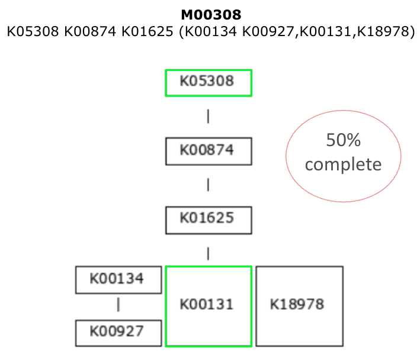
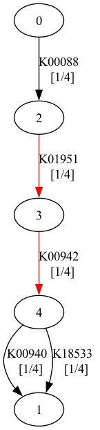
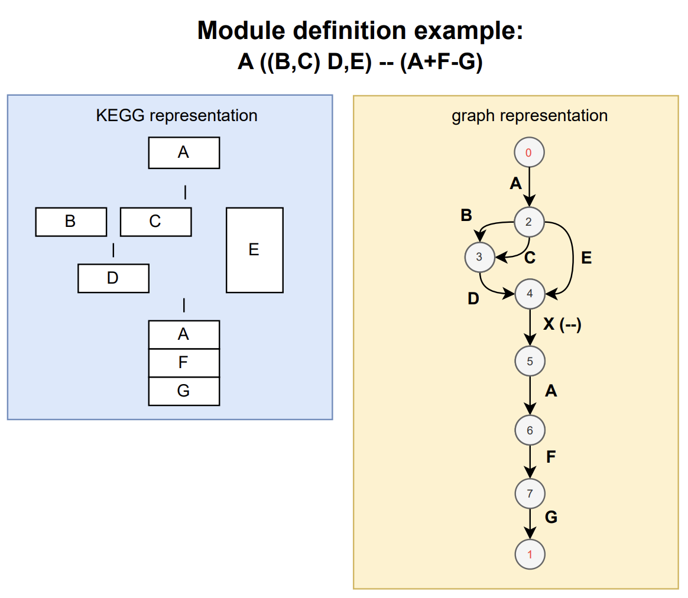
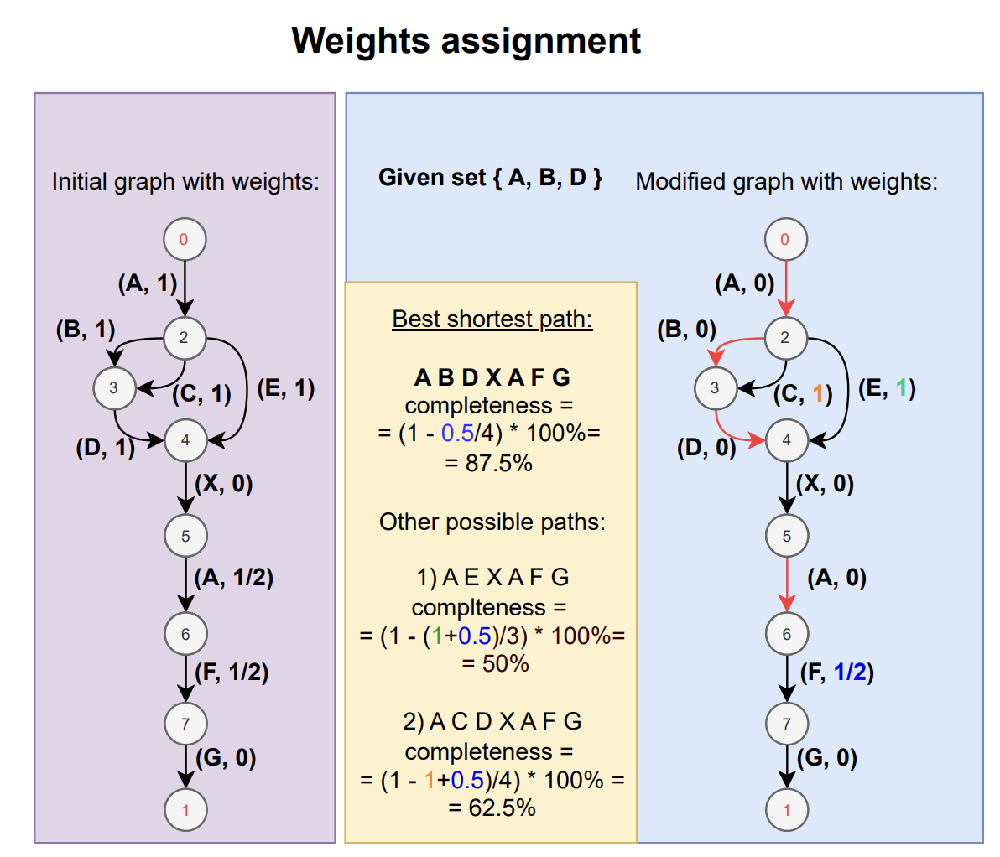

# kegg-pathways-completeness tool

This tool computes the completeness of [KEGG pathway modules](https://www.genome.jp/kegg/module.html) for a given set of [KEGG Orthologues (KOs)](https://www.genome.jp/kegg/ko.html) based on their presence/absence. 

The current version includes **570** KEGG modules (updated 19/01/2026).

Please, read the [Theory & Background](#theory--background) section for a detailed explanation.

## Table of Contents



- [Installation](#installation)
- [Prerequisites](#prerequisites)
- [Quick Start](#quick-start)
- [Detailed Usage](#detailed-usage)
  - [give_completeness](#give_completeness)
  - [plot_modules_graphs](#plot_modules_graphs)
- [Module Data Files](#module-data-files)
- [Output Files](#output-files)
- [Theory & Background](#theory--background)
- [Updating Module Data](#updating-module-data)
- [Complete Workflow](#complete-workflow)
- [Citation](#citation)

## Installation

The tool is available via PyPI, Bioconda, and Docker.

### Install with pip
```bash
pip install kegg-pathways-completeness
```

### Install with bioconda
```bash
conda install -c bioconda kegg-pathways-completeness
```

See [bioconda recipe](https://bioconda.github.io/recipes/kegg-pathways-completeness/README.html) for details.

### Docker
```bash
docker pull quay.io/biocontainers/kegg-pathways-completeness
```

### Install from source (for development)
```bash
git clone https://github.com/EBI-Metagenomics/kegg-pathways-completeness-tool.git
cd kegg-pathways-completeness-tool
pip install -e .
```

## Prerequisites

- **Python**: 3.8 or higher
- **graphviz**: Required for pathway visualization (install via system package manager)
- **[HMMER](http://hmmer.org/)** (optional): For annotating protein sequences with KOs

## Quick Start
Tool uses pre-generated files `modules_table.tsv` and `graphs.pkl` described in [Module Data Files](#module-data-files).
### Option 1: From a list of KOs

**Input format** ([example](tests/fixtures/give_completeness/test_kos.txt)): File with KO identifiers
```
K00001,K00002,K00003
```
command: 
```bash
give_completeness \
  --input-list kos_list.txt \
  --list-separator ',' \
  --outprefix my_analysis
```

### Option 2: From per-contig KO annotations

**Input format** ([example](tests/fixtures/give_completeness/test_pathway.txt)): Tab-separated file with contig names and KOs
```
contig_1	K00001	K00002	K00003
contig_2	K00004	K00005
```
command:
```bash
give_completeness \
  --input ko_annotations.tsv \
  --outprefix my_analysis 
```

## Detailed Usage

### give_completeness

Calculate KEGG pathway module completeness from KO annotations.

#### Required Arguments

**Input** (choose one):
- `-i, --input <FILE>`: Tab-separated file with contig names and KOs ([example](tests/fixtures/give_completeness/test_pathway.txt))
- `-l, --input-list <FILE>`: List of KOs, separated by delimiter ([example](tests/fixtures/give_completeness/test_kos.txt))

**Module data**:
- `-t, --modules-table <FILE>`: Module information in TSV format (columns: module, definition, name, class)
  - Default: Uses packaged `kegg_pathways_completeness/pathways_data/modules_table.tsv`
- `-g, --graphs <FILE>`: Custom graphs file (default: uses packaged `kegg_pathways_completeness/pathways_data/graphs.pkl`)

#### Optional Arguments

- `-s, --list-separator <CHAR>`: Separator for `--input-list` (default: `,`)
- `-o, --outdir <DIR>`: Output directory (default: current directory)
- `-r, --outprefix <PREFIX>`: Prefix for output files (default: `summary.kegg`)
- `-m, --add-per-contig`: Generate per-contig completeness table
- `-w, --include-weights`: Include KO weights in output (e.g., `K00942(0.25)`)
- `-p, --plot-pathways`: Generate pathway visualization plots
- `-v, --verbose`: Enable verbose logging

#### Examples

```bash
# Basic usage with KO list
give_completeness \
  --input-list kos.txt \
  --modules-table kegg_pathways_completeness/pathways_data/modules_table.tsv \
  --graphs kegg_pathways_completeness/pathways_data/graphs.pkl \
  --outprefix sample1

# Full analysis with per-contig results, weights, and plots
give_completeness \
  --input ko_annotations.tsv \
  --outprefix sample1 \
  --add-per-contig \
  --include-weights \
  --plot-pathways \
  --outdir results/

# Using custom module data
give_completeness \
  --input ko_annotations.tsv \
  --modules-table custom_modules.tsv \
  --graphs custom_graphs.pkl \
  --outdir custom_analysis
```

### plot_modules_graphs

Generate pathway visualization with KOs highlighted.

**Note**: Requires [graphviz](https://graphviz.org/) to be installed.

#### Required Arguments

**Input** (choose one):
- `-i, --input-completeness <FILE>`: Completeness output from `give_completeness`
- `-m, --modules <ID> [<ID> ...]`: Module IDs to plot (can be specified multiple times)
- `-l, --modules-file <FILE>`: File containing module IDs (one per line)

**Graphs**:
- `-g, --graphs <FILE>`: Graphs pickle file (default: `pathways_data/graphs.pkl`)

#### Optional Arguments

- `-s, --file-separator <CHAR>`: Separator in modules file (default: newline)
- `-o, --outdir <DIR>`: Output directory (default: `pathways_plots`)
- `--use-pydot`: Use pydot instead of graphviz backend

#### Examples

```bash
# Plot from completeness results
plot_modules_graphs \
  -i sample1_pathways.tsv \
  -g kegg_pathways_completeness/pathways_data/graphs.pkl \
  -o pathway_plots

# Plot specific modules
plot_modules_graphs \
  -m M00001 M00002 M00050 \
  -g kegg_pathways_completeness/pathways_data/graphs.pkl

# Plot modules from file
plot_modules_graphs \
  -l modules_of_interest.txt \
  -g kegg_pathways_completeness/pathways_data/graphs.pkl

# Use pydot backend
plot_modules_graphs \
  -i sample1_pathways.tsv \
  -g kegg_pathways_completeness/pathways_data/graphs.pkl \
  --use-pydot
```

**Output**:
- PNG images with pathways (present KOs in red)
- DOT source files (when using `--use-pydot`)



More visualization examples: [test output plots](tests/outputs/give_completeness/pathways_plots)

## Module Data Files

The package includes pre-generated data files in [`pathways_data/`](kegg_pathways_completeness/pathways_data):

### modules_table.tsv

Unified TSV file with all module information.

**Columns**:
- `module`: Module ID (e.g., M00001)
- `definition`: KEGG module definition in KO notation
- `name`: Module name/description
- `class`: Module classification/category

**File**: [modules_table.tsv](kegg_pathways_completeness/pathways_data/modules_table.tsv)

### graphs.pkl

Pre-parsed NetworkX directed graphs for all modules. Each pathway definition has been converted to a graph structure for completeness calculation.

**File**: [graphs.pkl](kegg_pathways_completeness/pathways_data/graphs.pkl)

## Output Files

### Pathway completeness table (`*_pathways.tsv`)

Main output with completeness scores for all detected pathways.

**Columns**:
- `module_accession`: Module ID
- `completeness`: Completeness percentage (0-100)
- `pathway_name`: Module name
- `pathway_class`: Module classification
- `matching_ko`: KOs found in the pathway
- `missing_ko`: KOs required but not found

**Example**: [test_kos_pathways.tsv](tests/outputs/give_completeness/test_kos_pathways.tsv)

### Per-contig completeness (`*_contigs.tsv`)

Generated with `-m/--add-per-contig` flag. Same format as above but with contig name as first column.

**Example**: [test_pathway_contigs.tsv](tests/outputs/give_completeness/test_pathway_contigs.tsv)

### Weighted output (`*.with_weights.tsv`)

Generated with `-w/--include-weights` flag. Includes weight values for each KO in parentheses (e.g., `K00942(0.25)` means weight = 0.25).

**Example**: [test_weights_pathways.with_weights.tsv](tests/outputs/give_completeness/test_weights_pathways.with_weights.tsv)

### Pathway plots (`pathways_plots/`)

Generated with `-p/--plot-pathways` flag. Contains:
- PNG images with pathway graphs
- Present KOs highlighted in red
- Missing KOs in black

**Example directory**: [pathways_plots/](tests/outputs/give_completeness/pathways_plots)

## Theory & Background

### How KEGG modules are represented

KEGG provides pathway definitions as logical expressions of KOs.

**Example**: `(K00844,K12407) (K01810,K06859,K13810) (K00850,K16370) K00918`

**Notation**:
- **Space** = AND (all components required)
- **Comma** = OR (any one component required)
- **Plus (+)** = Essential component
- **Minus (-)** = Optional component
- **Double minus (--)** = Missing optional (replaced with K00000 with 0 weight)
- **Newline** = Mediator (multi-line definitions use AND between lines)

**Examples**:
- [M00014](https://www.genome.jp/module/M00014) - module with missing optionals ([graph](tests/outputs/plot_modules_graphs/pathways_plots/M00014.png))
- [M00031](https://www.genome.jp/module/M00031) - module with mediators ([graph](tests/outputs/plot_modules_graphs/pathways_plots/M00031.png))

### Pathway to graph conversion

Each KEGG module definition is converted into a directed graph using NetworkX:
- **Start node**: 0
- **End node**: 1
- **Edges**: Represent KOs with assigned weights



### Completeness calculation

**Algorithm**:
1. Each edge in the graph has a weight based on its importance (calculated from pathway structure)
2. For a given set of KOs:
   - Present KOs → edge weight = original weight
   - Missing KOs → edge weight = 0
3. Find the path from node 0 to node 1 with minimum `(current_weight / original_weight)` ratio
4. Calculate completeness:

```
completeness = (path_weight / max_path_weight) × 100%
```



**Note on mediators**: Some modules have multi-line definitions where each line represents a mediator component. All mediators are connected with AND operators. The complete list of modules with mediators is in [definition_separated.txt](kegg_pathways_completeness/pathways_data/definition_separated.txt).

## Updating Module Data

To update module data to the latest KEGG version, see the [update documentation](docs/update_database.md).

The update process includes:
1. Fetching latest module definitions from KEGG API
2. Generating the unified `modules_table.tsv`
3. Creating NetworkX graphs from module definitions
4. Validating and testing the updated data


## Complete Workflow

### From raw sequences to pathway completeness

```bash
# Step 1: Annotate protein sequences using HMMER
# Download KEGG profiles database (KOfam) from KEGG
hmmscan --domtblout hmmer_output.tbl \
  --cpu 4 \
  profiles.hmm \
  sequences.faa

# Step 2: Parse HMMER output to extract KO annotations per contig
parse_hmmer_table \
  -i hmmer_output.tbl \
  -f sequences.faa \
  -t hmmscan \
  -o ko_annotations.tsv

# Step 3: Calculate pathway completeness
give_completeness \
  -i ko_annotations.tsv \
  -t kegg_pathways_completeness/pathways_data/modules_table.tsv \
  -r my_sample \
  -m \
  -w \
  -p

# Step 4 (optional): Visualize specific modules
plot_modules_graphs \
  -i my_sample_pathways.tsv \
  -g kegg_pathways_completeness/pathways_data/graphs.pkl \
  -o pathway_plots
```
See [detailed documentation](docs/parse_hmmer_table.md) about hmmer usage and parsing.


---
## Citation

If you use this tool in your research, please cite 
> Richardson L, Allen B, Baldi G, Beracochea M, Bileschi ML, Burdett T, et al. MGnify: the microbiome sequence data analysis resource in 2023 [Internet]. Vol. 51, Nucleic Acids Research. Oxford University Press (OUP); 2022. p. D753–9. Available from: http://dx.doi.org/10.1093/nar/gkac1080.

**Issues & Contributions**: Report bugs or request features on [GitHub Issues](https://github.com/EBI-Metagenomics/kegg-pathways-completeness-tool/issues)

**License**: Apache License 2.0
