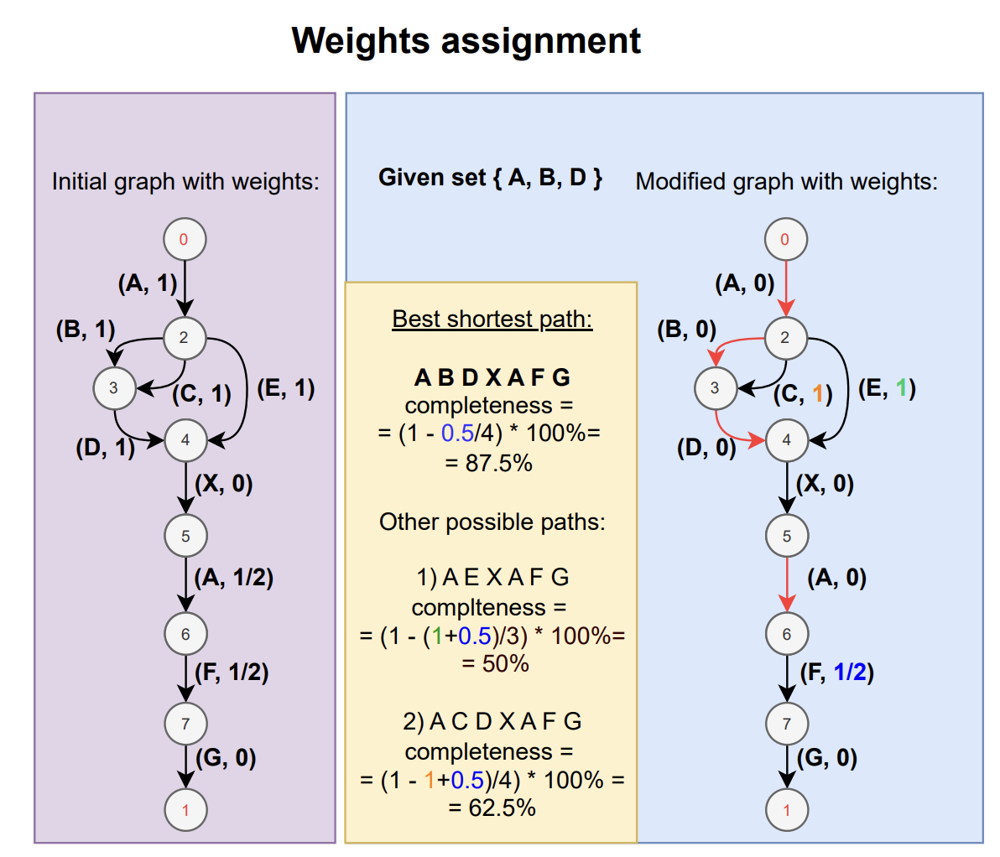

# kegg-pathways-completeness tool

This tool computes the completeness of each [KEGG pathway module](https://www.genome.jp/kegg/module.html) for given set of [KEGG orthologues (KOs)](https://www.genome.jp/kegg/ko.html) based on their presence/absence. The current version of this tool has **495** KEGG modules (updated 06/12/2024). 

Please, read the **Theory** section at the bottom of this README for a detailed explanation. 

#### Input example:
- [per contig annotation](tests/fixtures/give_completeness/test_pathway.txt) with KOs (ideally given from hmmscan annotation (see [instructions](kegg_pathways_completeness/bin/parse_hmmtable/README.md)));  

**OR** 

- [list](tests/fixtures/give_completeness/test_kos.txt) of KOs.

#### Output example:

- `*_pathways.tsv` ([example](tests/outputs/give_completeness/test_kos_pathways.tsv)) contains module pathways completeness calculated for all KOs in the given input file.

Optional:
- `*_contigs.tsv` ([example](tests/outputs/give_completeness/test_pathway_contigs.tsv)) contains module pathways completeness calculated per each contig (first column contains name of contig).
- `pathways_plots/` ([example](tests/outputs/give_completeness/pathways_plots)) folder containing PNG representation and graphs generated with `--plot-pathways` argument. 
- `*.with_weights.tsv` [example](tests/outputs/give_completeness/test_weights_pathways.with_weights.tsv) of output generated with `--include-weights` argument. Each KO has a weight in brackets.

Check more examples of different output files [here](tests/outputs).

## Installation
This tool was published in Pypi and Bioconda. \
Docker container is available on DockerHub and Quay.

#### Install with pip
```commandline
pip install kegg-pathways-completeness
```

#### Install with bioconda
Follow [bioconda instructions](https://bioconda.github.io/recipes/kegg-pathways-completeness/README.html#package-package%20&#x27;kegg-pathways-completeness&#x27;)

#### Docker 
```
docker pull quay.io/biocontainers/kegg-pathways-completeness
```

#### Install from source or for development
```commandline
git clone https://github.com/EBI-Metagenomics/kegg-pathways-completeness-tool.git
cd kegg-pathways-completeness-tool
pip install .
```


## How to run

#### Quick start
```
# --- Using list of KOs
# simple run
give_completeness -l {INPUT_LIST} 

# test example:
# give_completeness \
#   --input-list 'tests/fixtures/give_completeness/test_kos.txt' \
#   --outprefix test_list_kos \
#   --list-separator ','

# --- per contig annotation with KOs
# simple run
give_completeness -i {INPUT_FILE}

# test example:
# give_completeness \
#   --input 'tests/fixtures/give_completeness/test_pathway.txt' \
#   --outprefix test_pathway \
#   --add-per-contig \
```

## Input arguments description

**Required arguments:** 

_input file:_

An input file is required under either of the following commands:
- input table (`-i`/`--input`): hmmsearch table ([example](tests/fixtures/give_completeness/test_pathway.txt)) that was run on KEGG profiles DB with annotated sequences (preferable). If you don't have this table, follow [instructions](kegg_pathways_completeness/bin/parse_hmmtable/README.md) to generate it.
- file with KOs list (`-l`/`--input-list`): file with list of KOs ([example](tests/fixtures/give_completeness/test_kos.txt)).

**Optional arguments:**

- KOs separator **for list option** (`-s`/`--list-separator`): default is `,` (comma)
- output directory (`-o`/`--outdir`): default is currently working directory
- output prefix (`-r`/`--outprefix`): prefix for output tables (`-r test_kos` in [example](tests/outputs/give_completeness/test_kos_pathways.tsv))
- add weight information to output files (`-w`/`--include-weights`). The output table will contain the weight of each KO edge in the pathway graph, for example K00942(0.25) means that the KO has 0.25 importance in the given pathway. Example of [output](tests/outputs/give_completeness/test_weights_pathways.with_weights.tsv).
- plot present KOs in pathways (`-p`/`--plot-pathways`): generates a PNG containing a schematic representation of the pathway. Presented KOs are marked with red edges. Example: [M00002](tests/outputs/give_completeness/pathways_plots/M00002.png).
- generate a table with per-contig modules completeness (`-m`/`--add-per-contig`): generates `*_contigs.tsv` calculating completeness per each contig for each module. That option makes sense to use only with `--input` containing information about contigs. If you send a list of KOs as input that means you do not provide information about contigs and `*_contigs.tsv` and `*_pathways.tsv` would be identical. [Example](tests/outputs/give_completeness/test_pathway_contigs.tsv).

### _pathways_data: modules information and graphs_ 

This repository contains a set of pre-generated files. Modules information files can be found in **[pathways_data](kegg_pathways_completeness/pathways_data)**. 
The repository also contains pre-parsed module pathways into graphs format. In order to generate graphs all pathways were parsed with the NetworkX library. 

_modules information:_

- list of KEGG modules in KOs notation (`-a`/`--definitions`) (latest [all_pathways.txt](kegg_pathways_completeness%2Fpathways_data%2Fall_pathways.txt))
- list of classes of KEGG modules (`-c`/`--classes`) (latest [all_pathways_class.txt](kegg_pathways_completeness%2Fpathways_data%2Fall_pathways_class.txt))
- list of names of KEGG modules (`-n`/`--names`) (latest [all_pathways_names.txt](kegg_pathways_completeness%2Fpathways_data%2Fall_pathways_names.txt))

_graphs:_

- graphs constructed from each module (`-g`/`--graphs`) (latest [graphs.pkl](kegg_pathways_completeness%2Fpathways_data%2Fgraphs.pkl)))

Latest release has a **plots** archive with images and graphviz-files for all modules. The graph for every module is shown in `.png` format in **png** folder and contains corresponding `graphviz` file in **graphs** folder. Pathway and weights of each KO can be easily checked with the .png image.

**In order to run a tool there is no need to re-generate those files.** 

All module data generation commands and graphs creation instructions are also [available](kegg_pathways_completeness/pathways_data/README.md) for updates and understanding a process.

### Pathways visualization 

**NOTE**: please make sure you have [**graphviz**](https://graphviz.org/) installed

You can also run the [plotting script](kegg_pathways_completeness/bin/plot_modules_graphs.py) separately:

#### Plot modules of interest
```commandline
plot_modules_graphs.py -l tests/fixtures/plot_modules_graphs/modules_list.txt
```

#### Plot graphs knowing completeness 
```commandline
plot_modules_graphs.py -i tests/outputs/give_completeness/test_kos_pathways.tsv
```

#### Example


More examples for test data [here](tests/outputs/give_completeness/pathways_plots).


## Theory: 
#### Pathways to graphs 
KEGG provides a representation of each pathway as a specific expression of KOs. \
Example **A ((B,C) D,E) -- (A+F-G)** where:
- A, B, C, D, E, F, G are KOs
- **space** == AND
- **comma** == OR
- **plus** == essential component
- **minus** == optional component
- **minus minus** == missing optional component (replaced into K00000 with 0 weight (example: [KEGG](https://www.genome.jp/module/M00014), corresponding [graph](tests/outputs/plot_modules_graphs/pathways_plots/M00014.png)))
- **new line** == mediator (example: [KEGG](https://www.genome.jp/module/M00031), corresponding [graph](tests/outputs/plot_modules_graphs/pathways_plots/M00031.png))

#### ------ Mediator addition note ------
There are some modules that have DEFINITION with line separated KOs. Those KOs are interpreted as mediators. Each line is connected with `AND` operator. It is considered that each line plays a crucial role into module that is why it influences weights assignment quite much.  
All list of those modules presented in [definition_separated.txt](kegg_pathways_completeness%2Fpathways_data%2Fdefinition_separated.txt).

*The question is how to use mediators is very difficult for current realisation and is under debate.*
#### ------------------------------------------------

Each expression was [converted](kegg_pathways_completeness/bin/make_graphs.py) into a directed graph using NetworkX. The first node is node 0 and the last one is node 1. Each edge corresponds to a KO. 


#### Completeness
In order to compute pathways completeness, each node in the graph is weighted. The default weight of each edge is 0.

Given a set of predicted KOs, if the KO is present in the pathway, the corresponding edge will have assigned weight = 1 (or 0 if edge is optional or another value if edge is connected by +). After that, this [script](kegg_pathways_completeness/bin/give_completeness.py) searches the most relevant path by `graph_weight` from node 0 to node 1. `max_graph_weight` is then calculated under the assumption that all KOs are present.

``
completeness = graph_weight/max_graph_weight * 100%
``


